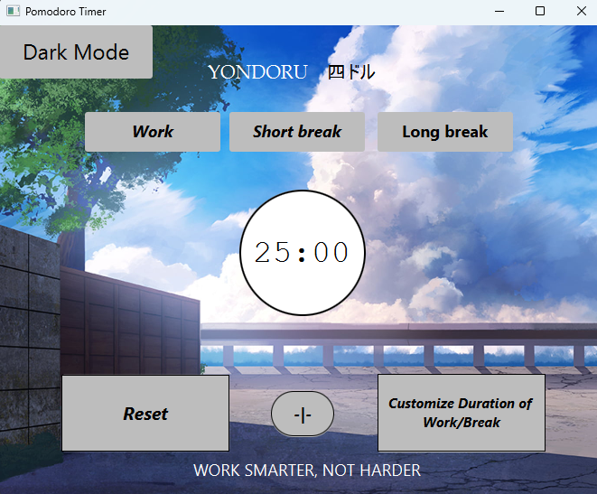
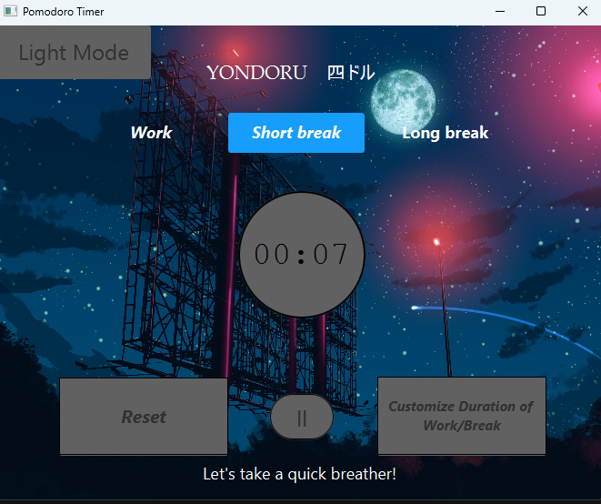
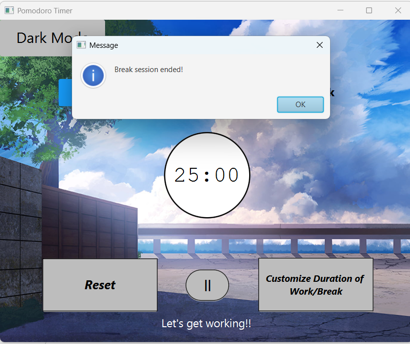
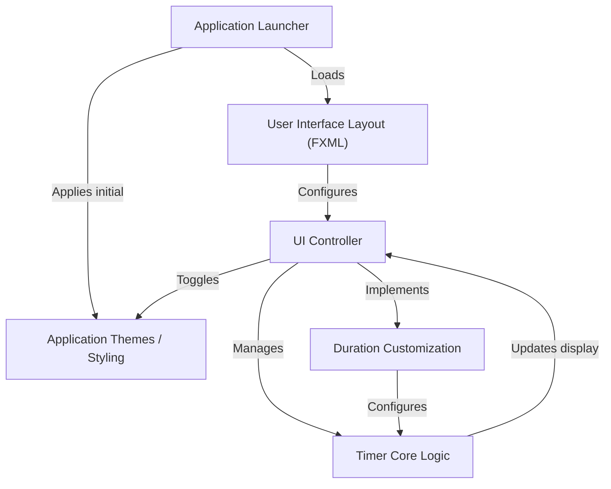
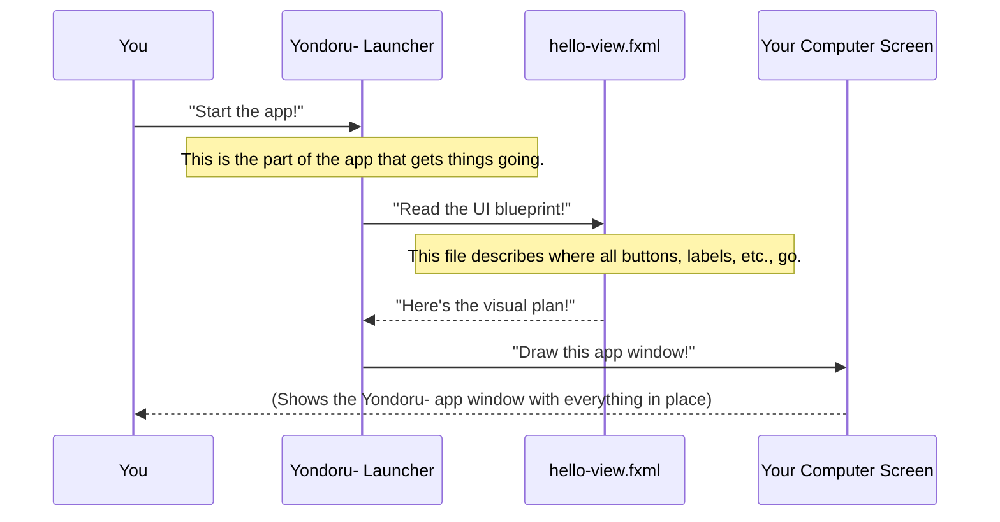
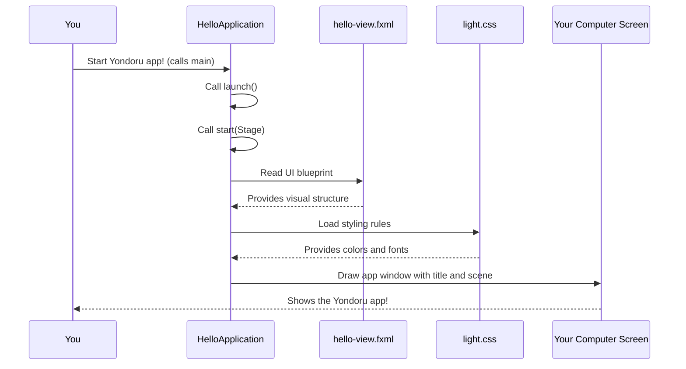
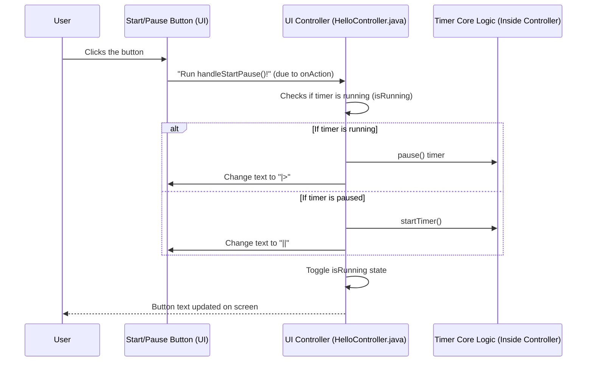
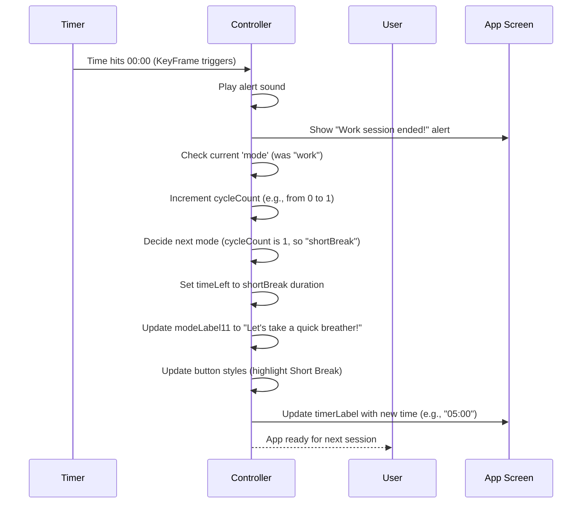
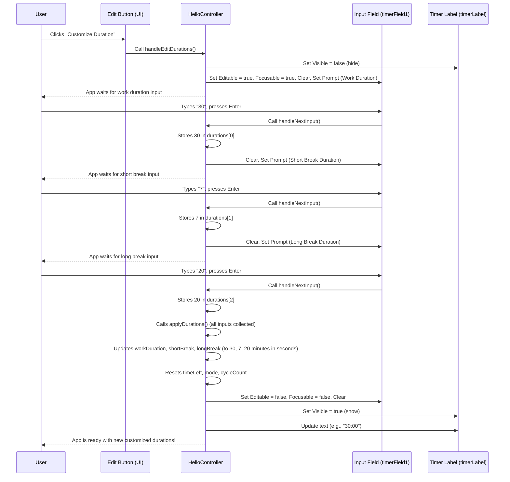
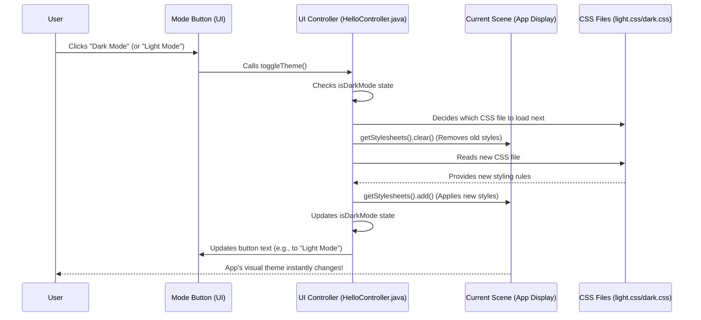

<h1><strong>Yondoru — Pomodoro Timer Application</strong></h1>
<p>Yondoru is a <strong>Pomodoro timer application</strong> designed to help users <em>efficiently manage their work and break intervals</em>. 
With a simple and intuitive interface, Yondoru lets you <strong>start, pause, and reset timers</strong>, customize durations for work sessions and breaks, and even <strong>switch between light and dark themes</strong> to suit your preference.</p>

<hr>

<h2>Features:</h2>
<ul>
    <li>Simple <strong>Start / Pause / Reset</strong> timer controls</li>
    <li>Customizable <strong>work and break durations</strong></li>
    <li>Toggle between <strong>light and dark themes</strong></li>
    <li>Clean and responsive user interface</li>
    <li>Built with <strong>JavaFX</strong>, styled with <strong>CSS</strong></li>
    <li><strong>Maven-based</strong> build system for easy compilation and packaging</li>
</ul>

<hr>

<h2>🖼️ Visual Overview</h2>

<table>
  <tr>
    <td align="center">
      <br>
      <em>Main Timer Screen (Light Theme)</em>
    </td>
    <td align="center">
      <br>
      <em>Main Timer Screen (Dark Theme)</em>
    </td>
    <td align="center">
      <br>
      <em>Alarm Timer</em>
    </td>
  </tr>
</table>

<hr>

  </pre> <hr> <h2>📂 File Structure</h2> 
   <pre>
   Directory structure:
└── ishraqgit-yondoru/
    ├── mvnw
    ├── mvnw.cmd
    ├── pom.xml
    ├── src/
    │   └── main/
    │       ├── java/
    │       │   ├── module-info.java
    │       │   └── com/
    │       │       └── example/
    │       │           └── demo6/
    │       │               ├── HelloApplication.java
    │       │               ├── HelloController.java
    │       │               └── tempCodeRunnerFile.java
    │       └── resources/
    │           └── com/
    │               └── example/
    │                   └── demo6/
    │                       ├── dark.css
    │                       ├── hello-view.fxml
    │                       └── light.css
    └── .mvn/
        └── wrapper/
            └── maven-wrapper.properties 
   </pre> <hr> <h2>
   
   📚 Project Modules</h2> <h3>1️⃣ Application Entry Point</h3> <p>The entry point of Yondoru is the <code>HelloApplication</code> class, which launches the JavaFX application and loads the main FXML layout with initial CSS styling.</p> <strong>Key responsibilities:</strong> <ul> <li>Initialize the JavaFX stage and scene</li> <li>Load the main user interface from FXML</li> <li>Apply default stylesheet (light or dark theme)</li> </ul> <h3>2️⃣ User Interface Definition (FXML)</h3> <p>The UI is defined using <strong>FXML</strong>, separating visual layout from application logic. This makes it easy to customize and switch themes.</p> <strong>Components:</strong> <ul> <li>Timer display label</li> <li>Start, Pause, and Reset buttons</li> <li>Settings panel <em>(future expansion)</em></li> <li>Theme toggle controls</li> </ul> <h3>3️⃣ UI Controller Logic</h3> <p>The <code>HelloController</code> class handles user interactions, button clicks, and UI updates.</p> <strong>Responsibilities:</strong> <ul> <li>Handle Start / Pause / Reset events</li> <li>Update timer display every second</li> <li>Respond to theme toggle input</li> <li>Validate timer customization inputs</li> </ul> <h3>4️⃣ Pomodoro Timer Core Logic</h3> <p>The core logic manages the countdown, session transitions, and timing behavior.</p> <strong>Features:</strong> <ul> <li>Countdown timer implementation</li> <li>Automatic switching between work and break sessions</li> <li>Pause / Resume functionality</li> <li>Event listeners for timer completion</li> </ul> <h3>5️⃣ Application Styling (CSS)</h3> <p>Styling is handled via <strong>external CSS files</strong>, enabling light/dark mode switching.</p> <strong>Details:</strong> <ul> <li>Base styles for fonts, colors, and spacing</li> <li>Separate <code>light.css</code> and <code>dark.css</code> files</li> <li>Dynamic stylesheet switching from the controller</li> </ul> <h3>6️⃣ Maven Build System</h3> <p>Maven manages the build lifecycle, dependencies, and packaging.</p> <strong>Highlights:</strong> <ul> <li>Dependency management (JavaFX libraries)</li> <li>Build commands for compiling and running</li> <li>Packaging into JAR or native bundles <em>(planned)</em></li> </ul> <hr> <h2>⚙️ How to Use</h2> <h3>Prerequisites</h3> <ul> <li>Java <strong>JDK 11+</strong></li> <li>Maven installed</li> <li>Compatible IDE (IntelliJ IDEA, Eclipse, etc.) or terminal access</li> </ul> <h3>Setup & Running</h3> <ol> <li>Clone the repository: <pre><code>git clone https://github.com/IshraqGit/Yondoru.git cd Yondoru</code></pre></li>

   <li>Build the project:
<pre><code>mvn clean install</code></pre></li>

<li>Run the application:
<pre><code>mvn javafx:run</code></pre></li>

</p> <hr> <h2>🛠️ Contributing</h2> <p>Contributions are welcome!</p> <strong>Steps to contribute:</strong> <ol> <li>Fork the repo</li> <li>Create a new branch: <pre><code>git checkout -b feature-name</code></pre></li>

<li>Commit your changes:
<pre><code>git commit -m "Add some feature"</code></pre></li>

<li>Push the branch:
<pre><code>git push origin feature-name</code></pre></li>

<li>Open a pull request</li>

# Tutorial: Yondoru-

This project is a **Yondoru (Pomodoro) timer** application designed to help users manage their work and break sessions effectively. It features a *user-friendly interface* built with JavaFX, allowing users to start, pause, and reset countdowns. The application also provides *flexible customization options* for setting the duration of work, short breaks, and long breaks, alongside the ability to *toggle between dark and light themes* for personalized aesthetics.


## Visual Overview



## Chapters

1. [User Interface Layout (FXML)
](01_user_interface_layout__fxml__.md)
2. [Application Launcher
](02_application_launcher_.md)
3. [UI Controller
](03_ui_controller_.md)
4. [Timer Core Logic
](04_timer_core_logic_.md)
5. [Duration Customization
](05_duration_customization_.md)
6. [Application Themes / Styling
](06_application_themes___styling_.md)

---

# Chapter 1: User Interface Layout (FXML)

Welcome, future Yondoru- developer! This is the very first step in understanding how our productivity timer app, Yondoru-, is built. Have you ever wondered how apps know where to put buttons, text, and images on your screen? It's not magic! It's thanks to something called a "User Interface Layout."

### What's the Problem We're Solving?

Imagine you're designing a new room in your house. You wouldn't just tell the builder, "Put a window somewhere." You'd give them a detailed blueprint, right? A blueprint shows exactly where the windows, doors, and furniture should go, what size they are, and maybe even their color.

Our Yondoru- app needs a similar blueprint for its screen. We need to tell the computer:
*   "Put a big timer in the middle."
*   "Add buttons for 'Work', 'Short Break', and 'Long Break' at the top."
*   "There should be a 'Start/Pause' button at the bottom."

How do we create this visual blueprint? We use something called **FXML**.

### FXML: App's Blueprint

FXML stands for **F**X **M**arkup **L**anguage. Think of it as a special kind of text file that describes what your app's screen looks like. It's like an architectural blueprint for your app's user interface (UI). It focuses only on the *structure* and *initial appearance* of what you see. It doesn't tell the buttons what to *do* when you click them – that's for later!

In Yondoru-, our main UI blueprint is found in a file named `hello-view.fxml`.

### Peeking Inside Yondoru-'s Blueprint (`hello-view.fxml`)

Let's open up `src/main/resources/com/example/demo6/hello-view.fxml` and see what's inside. You'll see lots of words wrapped in `<` and `>` symbols. These are called **tags**, and they represent different UI components, like buttons or labels.

The very first important tag is `<AnchorPane>`. This is like the main "canvas" or "frame" for our entire app window. Everything else is placed inside it.

```xml
<AnchorPane fx:id="root" prefHeight="522.0" prefWidth="669.0" ...>
    <!-- All other UI elements go here -->
</AnchorPane>
```

*   `AnchorPane`: This is a type of layout container. It lets us precisely place items using coordinates (like `layoutX` and `layoutY`).
*   `fx:id="root"`: This is a special name we give to this `AnchorPane` so we can refer to it later in our code. Think of it as a unique ID for this part of the blueprint.
*   `prefHeight` and `prefWidth`: These set the preferred height and width of our app window.

#### Adding Buttons to the Blueprint

Let's look at one of the buttons, for example, the "Work" button:

```xml
<Button fx:id="workButton" layoutX="95.0" layoutY="96.0" onAction="#handleWork" ...
        text="Work" ...>
    <!-- ... font details ... -->
</Button>
```

*   `<Button>`: This tag tells FXML we want a button!
*   `fx:id="workButton"`: Just like with the `AnchorPane`, this gives a unique ID to our "Work" button. We can use this ID in other parts of our program to make the button do things or change its look.
*   `layoutX="95.0"` and `layoutY="96.0"`: These numbers tell the `AnchorPane` exactly where to place the button on the screen. `layoutX` is how far from the left edge, and `layoutY` is how far from the top edge.
*   `onAction="#handleWork"`: This is super important! It's a special instruction that says, "When this button is clicked, go find a method (a piece of code) called `handleWork` and run it!" We'll learn more about these "methods" in [UI Controller](03_ui_controller_.md).
*   `text="Work"`: This simply sets the initial text that appears on the button.

What does this snippet achieve? It creates a button on your screen that says "Work" and is positioned specifically within the window.

#### Displaying Information with Labels

Next, let's look at how we display the timer itself using a `Label`:

```xml
<Label fx:id="timerLabel" layoutX="281.0" layoutY="230.0" style="-fx-font-size: 36px;" text="25:00" />
```

*   `<Label>`: This tag means we want to display some text that the user can see but can't edit.
*   `fx:id="timerLabel"`: Another unique ID, this time for our timer display.
*   `layoutX` and `layoutY`: Again, these position the label on the screen.
*   `text="25:00"`: This is the initial text the label will show when the app starts.
*   `style="-fx-font-size: 36px;"`: This is a little bit of styling to make the text big and easy to read. We'll talk more about styling in [Application Themes / Styling](06_application_themes___styling_.md).

This label will appear on the screen, initially showing "25:00", right where the timer is in the Yondoru- app.

#### Getting Input with Text Fields

Sometimes, we need the user to type something into the app. For that, we use a `TextField`:

```xml
<TextField fx:id="timerField1" alignment="CENTER" layoutX="266.0" layoutY="182.0" onAction="#handleNextInput" ... />
```

*   `<TextField>`: This tag creates a box where users can type.
*   `fx:id="timerField1"`: Its unique ID.
*   `alignment="CENTER"`: Makes text typed inside appear in the center of the box.
*   `onAction="#handleNextInput"`: When the user types something and presses Enter, this tells the app to run the `handleNextInput` method. This is used when you want to customize the durations.

This `TextField` is used in Yondoru- to let you type in new work or break durations.

### How Does This Blueprint Become Your App?

So, we have this `hello-view.fxml` blueprint. How does it magically turn into the Yondoru- app you see on your screen? It's a bit like this:



In simple terms:
1.  You (or your computer) tell the Yondoru- app to start.
2.  A special part of the app, which we'll call the "[Application Launcher](02_application_launcher_.md)", is responsible for setting up the main window.
3.  The [Application Launcher](02_application_launcher_.md) reads our `hello-view.fxml` file. It understands all the `<Button>`, `<Label>`, and `<TextField>` tags and their properties.
4.  Based on this blueprint, the [Application Launcher](02_application_launcher_.md) creates the actual visual components on your computer screen.

This separation of the "look" (FXML) from the "behavior" (code that runs when you click a button) makes building apps much easier to manage!

### Conclusion

In this chapter, we learned that **FXML** is the blueprint for our app's user interface. It defines *what* visual components are on the screen (like buttons, labels, and text fields) and *where* they are placed. We saw how `fx:id` gives unique names to elements and how `onAction` hints at what happens when an element is interacted with.

Now that we understand how the UI is *designed*, our next step is to learn how the app actually *starts up* and loads this design.

Let's move on to [Chapter 2: Application Launcher](02_application_launcher_.md)!

---

# Chapter 2: Application Launcher

In the previous chapter, we learned about [User Interface Layout (FXML)](01_user_interface_layout__fxml__.md) and how it acts as a blueprint for our app's visual design. FXML tells us *what* goes where on the screen. But a blueprint on its own doesn't build a house, right? Something needs to take that blueprint and actually *construct* the house.

### What's the Problem We're Solving?

Imagine you have the most beautiful blueprint for a house (that's our `hello-view.fxml`!). How do you actually turn that drawing into a real house you can walk into? You need a **builder**!

In the world of Yondoru-, the problem is: **How do we take our FXML blueprint and make it appear as a running application window on your computer screen?**

This is where the **Application Launcher** comes in. It's like the main switch or the "builder" that starts everything up. Without it, our FXML file would just sit there, a beautiful design, but never becoming a usable app.

### The Application Launcher: Your App's Main Switch

The Application Launcher is the very first piece of code that runs when you start your `Yondoru-` app. Its job is to:

1.  **Prepare the main window:** Get a blank window ready.
2.  **Load the FXML blueprint:** Read our `hello-view.fxml` file to understand the layout.
3.  **Apply initial styles:** Make sure the app looks good right from the start (like adding colors or fonts).
4.  **Display everything:** Finally, make the window and all its contents visible to you.

In `Yondoru-`, this "launcher" code lives in the `HelloApplication.java` file.

### How Yondoru- Starts Up

Let's look at the `HelloApplication.java` file. This file contains the main "starting instructions" for our app.

First, there's a special method called `main`:

```java
public class HelloApplication extends Application {
    // ... other code ...

    public static void main(String[] args) {
        launch();
    }
}
```

*   `public static void main(String[] args)`: This is the very first line of code that runs when you launch *any* Java application. It's like flipping the main power switch.
*   `launch()`: This is a special command provided by JavaFX (the technology Yondoru- is built with). It tells the system, "Hey, I want to start a JavaFX application!" This command then automatically calls another important method, which is where the real building work begins: the `start` method.

### The `start` Method: Building the Window

The `launch()` command calls the `start` method. Think of the `start` method as the construction manager that takes the blueprint and builds the app's window step-by-step.

```java
public class HelloApplication extends Application {
    @Override
    public void start(Stage stage) throws Exception {
        // ... building steps go here ...
    }
    // ... other code ...
}
```

*   `@Override`: This simply means we are providing our own version of the `start` method, which is required by JavaFX.
*   `public void start(Stage stage)`: This method gets a `Stage` object as input. A `Stage` is like the physical window frame of your application – the border, the title bar, and the minimize/maximize/close buttons. Our job is to put content *inside* this `stage`.

Now let's see what happens *inside* the `start` method, step by step.

#### Step 1: Loading the Blueprint (FXML)

```java
    @Override
    public void start(Stage stage) throws Exception {
        // Create an FXML loader
        FXMLLoader fxmlLoader = new FXMLLoader(getClass().getResource("/com/example/demo6/hello-view.fxml"));

        // Load the FXML blueprint into a "Parent" object
        Parent root = fxmlLoader.load();

        // ... more steps ...
    }
```

*   `FXMLLoader fxmlLoader = new FXMLLoader(...)`: We create a special tool called an `FXMLLoader`. This tool knows how to read FXML files. We tell it *which* FXML file to read, which is our `hello-view.fxml`.
*   `Parent root = fxmlLoader.load();`: This line is where the magic happens! The `fxmlLoader` takes the instructions from `hello-view.fxml` and builds all the buttons, labels, and text fields you defined. It puts them all inside a single "container" called `root`. Think of `root` as the assembled contents of your app, ready to be placed inside the window.

#### Step 2: Creating the Scene

Once we have our assembled `root` (all the UI elements from FXML), we need to place it onto a "Scene." A `Scene` is like the actual painted picture or canvas that goes *inside* the window frame (`Stage`).

```java
    @Override
    public void start(Stage stage) throws Exception {
        // ... (previous FXML loading code) ...

        // Create a new Scene, putting our loaded UI (root) inside it
        Scene scene = new Scene(root);

        // ... more steps ...
    }
```

*   `Scene scene = new Scene(root);`: We create a new `Scene` and give it our `root` object. Now, our entire UI blueprint is neatly packaged into this `scene`.

#### Step 3: Applying Styles (CSS)

Just like you might paint the walls of your house after it's built, we apply visual styles to our app. In Yondoru-, we use CSS (Cascading Style Sheets) for this.

```java
    @Override
    public void start(Stage stage) throws Exception {
        // ... (previous FXML and Scene code) ...

        // Find the CSS file (light.css)
        URL css = getClass().getResource("/com/example/demo6/light.css");
        if (css != null) {
            // Add the CSS to our scene
            scene.getStylesheets().add(css.toExternalForm());
        } else {
            System.err.println("Could not load light.css"); // Just in case it's missing!
        }

        // ... more steps ...
    }
```

*   `URL css = getClass().getResource(...)`: This line finds our `light.css` file, which contains instructions on how buttons, labels, and the overall app should look (colors, font sizes, etc.). We'll dive deeper into this in [Application Themes / Styling](06_application_themes___styling_.md).
*   `scene.getStylesheets().add(...)`: We tell our `scene` to use the styles defined in the `light.css` file. This makes our app visually appealing!

#### Step 4: Setting up the Window (Stage) and Showing It

Finally, we take our `scene` (which now has both the layout and the styles) and place it into our `stage` (the window frame). Then, we tell the `stage` to show itself on the screen!

```java
    @Override
    public void start(Stage stage) throws Exception {
        // ... (previous FXML, Scene, and CSS code) ...

        // Set the title of the window
        stage.setTitle("Pomodoro Timer");

        // Put the scene into the stage (the window)
        stage.setScene(scene);

        // Make the window visible!
        stage.show();
    }
```

*   `stage.setTitle("Pomodoro Timer");`: This sets the text that appears in the title bar of your application window.
*   `stage.setScene(scene);`: This is like putting the completed picture (our `scene`) into its frame (the `stage`).
*   `stage.show();`: This command tells your computer to actually display the `stage` (the window) with everything inside it on your screen. And just like that, `Yondoru-` appears!

### How It All Connects

Here's a simple diagram to visualize the entire startup process:



This sequence shows how the `HelloApplication` acts as the central coordinator, bringing together the FXML layout and the CSS styles to create the visible application window.

### A Note on `module-info.java`

You might have noticed another small file, `module-info.java`:

```java
module com.example.demo6 {
    requires transitive javafx.controls;
    requires transitive javafx.graphics;
    requires javafx.fxml;
    requires java.desktop;
    requires javafx.media;

    opens com.example.demo6 to javafx.fxml;
    exports com.example.demo6;
}
```

This file is important for Java applications that use "modules" (a way to organize code). For `Yondoru-`, the key lines are:

*   `requires javafx.fxml;`: This tells our app, "Hey, I need the FXML part of JavaFX to load my UI blueprints."
*   `opens com.example.demo6 to javafx.fxml;`: This specifically allows the `FXMLLoader` (which is part of `javafx.fxml`) to look inside our project's `com.example.demo6` folder to find the `hello-view.fxml` file. Without this, the `FXMLLoader` wouldn't be able to "see" our FXML blueprint!

You typically won't need to change `module-info.java` often, but it's good to know why it's there.

### Conclusion

In this chapter, we unpacked the mystery of how `Yondoru-` actually starts up and displays its user interface. We learned that the `HelloApplication.java` file acts as the **Application Launcher**, containing the `main` method to kick things off and the `start` method to:

*   Load the visual layout from [User Interface Layout (FXML)](01_user_interface_layout__fxml__.md).
*   Apply visual styles from CSS (which we'll explore more in [Application Themes / Styling](06_application_themes___styling_.md)).
*   Set up the main window and make it visible.

Now that our app has a beautiful visual design (thanks to FXML) and can successfully launch, the next big question is: How do we make the buttons *do* something? How do we make the timer actually count down? That's what we'll explore in the next chapter!

Let's move on to [Chapter 3: UI Controller](03_ui_controller_.md)!

---

# Chapter 3: UI Controller

In the previous chapter, [Application Launcher](02_application_launcher_.md), we saw how `Yondoru-` starts up and displays its beautiful user interface by loading the blueprint from [User Interface Layout (FXML)](01_user_interface_layout__fxml__.md). We have the house, and it looks great, but what about making things happen inside it? Buttons, labels, and text fields are just pretty pictures if they don't *do* anything!

### What's the Problem We're Solving?

Imagine your `Yondoru-` app is displayed on the screen. You see the "Start/Pause" button, the "25:00" timer, and other mode buttons. But right now, they're just static images. The problem is: **How do we make these visual elements interactive? How do we make the "Start/Pause" button actually start and stop the timer, and how do we make the timer display count down?**

This is where the **UI Controller** comes into play. It's the **brain** that connects what you *see* on the screen to the *actions* your app performs.

### The UI Controller: The App's Brain

Think of the UI Controller as a puppet master. It knows about all the puppets (buttons, labels, text fields) on the stage (your app's window), and it pulls the strings to make them move and respond to your commands.

Specifically, the UI Controller is a special Java class (a blueprint for creating objects) that has several key responsibilities:

*   **Listening to User Actions:** It waits for you to click a button, type in a text field, or do anything else with the app's interface.
*   **Managing UI Elements:** It knows how to grab the timer label and change its text, or change the color of a button.
*   **Connecting to Logic:** When you click "Start", the Controller tells the core "timer logic" (which we'll explore in [Timer Core Logic](04_timer_core_logic_.md)) to begin counting.

In `Yondoru-`, our main UI Controller is found in the `HelloController.java` file.

### Connecting FXML to the Controller

How does our `hello-view.fxml` blueprint know *which* Java class is its brain (its Controller)? And how do buttons in FXML tell the Controller to run a specific action?

#### 1. Telling FXML Where the Brain Is: `fx:controller`

If you open `src/main/resources/com/example/demo6/hello-view.fxml`, you'll see a line near the top:

```xml
<AnchorPane ... fx:controller="com.example.demo6.HelloController">
```

*   `fx:controller="com.example.demo6.HelloController"`: This crucial line tells the FXML loader, "Hey, for this entire UI layout, `HelloController.java` is the class that will manage all the interactions and logic!" It's like writing "Managed by: HelloController" on the blueprint.

#### 2. Telling the Controller What to Do: `onAction`

Next, remember the `onAction` property we saw on buttons in Chapter 1?

```xml
<Button fx:id="startPauseButton" ... onAction="#handleStartPause" ... />
```

*   `onAction="#handleStartPause"`: This tells the button, "When someone clicks me, go find a method (a piece of code that does a specific task) called `handleStartPause` inside the `HelloController` and run it!" The `#` symbol is a shortcut to say "look in the controller for this method."

### How the Controller Interacts with UI Elements: `@FXML`

Now that FXML knows *which* Java class is the controller and *which* method to call on click, how does the `HelloController` Java code actually "talk" to the `timerLabel` or `startPauseButton` on the screen?

This is done using the `@FXML` annotation. It's like giving your Java code a direct phone line to the elements defined in your FXML file.

Let's look at parts of `src/main/java/com/example/demo6/HelloController.java`:

```java
import javafx.fxml.FXML; // Import the FXML annotation

public class HelloController {
    // These lines "connect" Java variables to FXML elements
    @FXML private Label timerLabel;
    @FXML private Button startPauseButton;

    // ... other code ...

    @FXML
    protected void handleStartPause() {
        // Here, we can now use timerLabel and startPauseButton
        // to change what's on the screen!
        if (isRunning) {
            startPauseButton.setText("|>"); // Change button text
        } else {
            startPauseButton.setText("||"); // Change button text
        }
        timerLabel.setText("00:00"); // Example: Change timer display
    }

    // ... rest of the controller logic ...
}
```

*   `@FXML private Label timerLabel;`: This line declares a variable named `timerLabel`. The `@FXML` magic tells JavaFX, "When this controller is loaded, find a `Label` element in the FXML file that has `fx:id="timerLabel"` and connect it to this variable!" Now, in your Java code, when you use `timerLabel`, you are directly referring to the actual timer display on your app's screen.
*   `@FXML private Button startPauseButton;`: Same idea here, connecting our `startPauseButton` variable to the button with `fx:id="startPauseButton"` in FXML.
*   `timerLabel.setText("00:00");`: Once connected, you can use methods like `setText()` to change the text displayed on the `timerLabel` right from your Java code. This is how the timer display updates every second!

This table summarizes the connection:

| FXML Part        | Java Controller Part      | What it Does                                       |
| :--------------- | :------------------------ | :------------------------------------------------- |
| `fx:controller`  | `public class HelloController` | Links the FXML blueprint to its "brain" Java class. |
| `fx:id="name"`   | `@FXML private Type name;` | Creates a direct "connection" to a UI element.     |
| `onAction="#method"` | `@FXML protected void method()` | Calls this specific method when the UI element is interacted with (e.g., clicked). |

### Solving Our Problem: Making the "Start/Pause" Button Work

Let's trace what happens when you click the "Start/Pause" button in `Yondoru-`.

#### Step-by-Step Walkthrough:

1.  **You Click:** You, the user, click the "Start/Pause" button on the `Yondoru-` app.
2.  **FXML Notifies:** Because the button's FXML has `onAction="#handleStartPause"`, JavaFX knows to look for this method in the `HelloController`.
3.  **Controller Takes Over:** The `handleStartPause()` method inside `HelloController.java` starts running.
4.  **Checks State:** Inside `handleStartPause()`, the code checks if the timer is currently running (`isRunning` variable).
    *   **If Running:** It tells the `timeline` (which manages the timer countdown, more on this in [Timer Core Logic](04_timer_core_logic_.md)) to `pause()`, and changes the `startPauseButton` text to `|>` (the "play" symbol).
    *   **If Paused:** It calls `startTimer()` (another method in the controller) to begin counting down, and changes the `startPauseButton` text to `||` (the "pause" symbol).
5.  **Toggles State:** Finally, the `isRunning` variable is flipped (`isRunning = !isRunning;`) so the controller knows the new state for the next click.
6.  **UI Updates:** The button's text immediately changes on the screen, reflecting the new state. If the timer started, the `timerLabel` will also start updating thanks to the `startTimer` method.

Here's a simplified flow:



#### Diving into the Code (`HelloController.java`):

Let's look at the actual code snippet for `handleStartPause()` and related parts.

```java
// Inside HelloController.java
// (Remember: @FXML connects these variables to FXML elements by their fx:id)
@FXML private Label timerLabel;
@FXML private Button startPauseButton;

private boolean isRunning = false; // A variable to keep track of timer state
private Timeline timeline; // Will manage the actual countdown

@FXML
protected void handleStartPause() {
    if (isRunning) { // If the timer is currently running
        timeline.pause(); // Stop the countdown
        startPauseButton.setText("|>"); // Change button to "Play" symbol
    } else { // If the timer is currently paused
        startTimer(); // Start the countdown (explained below)
        startPauseButton.setText("||"); // Change button to "Pause" symbol
    }
    isRunning = !isRunning; // Flip the state for the next click
}
```

*   `isRunning`: This is a simple `true`/`false` variable that keeps track of whether the timer is currently counting down or paused.
*   `timeline`: This is a JavaFX object that helps us perform actions repeatedly, like counting down every second. We'll learn more about it in [Timer Core Logic](04_timer_core_logic_.md). For now, just know `timeline.pause()` stops the countdown.
*   `startPauseButton.setText("|>");`: This line directly changes the text displayed on the "Start/Pause" button.

What about `startTimer()`? This method is also part of the `HelloController` and is responsible for setting up the `timeline` to count down and update the `timerLabel`. We won't show its full code here to keep it simple, but its main job is to:

```java
// Simplified look at startTimer()
private void startTimer() {
    // (Actual complex timer setup happens here)
    // For every second:
    //   timeLeft--; // Decrease the time
    timerLabel.setText(formatTime(timeLeft)); // Update the label
    // If timeLeft is 0, handle ending the session
    // ...
}

// Helper method to format time from seconds to MM:SS
private String formatTime(int totalSeconds) {
    int minutes = totalSeconds / 60;
    int seconds = totalSeconds % 60;
    return String.format("%02d:%02d", minutes, seconds);
}
```

*   `formatTime(int totalSeconds)`: This is a small helper method that takes the total number of seconds remaining and converts it into a nice "MM:SS" format (like "25:00" or "01:30") for the `timerLabel`.

### Conclusion

In this chapter, we learned that the **UI Controller** (`HelloController.java`) is the "brain" of our `Yondoru-` app. It's the central hub that:

*   Is linked to the FXML layout using `fx:controller`.
*   Uses `@FXML` to create direct connections to visual elements like buttons and labels defined in FXML.
*   Contains methods (like `handleStartPause()`) that are called when you interact with the UI (via `onAction`).
*   Manages the app's internal state (like `isRunning`) and updates the user interface accordingly.

Now that our app has a beautiful visual design, can launch, and its buttons can react to clicks, the next crucial step is to understand how the timer itself actually counts down and manages the work/break cycles.

Let's move on to [Chapter 4: Timer Core Logic](04_timer_core_logic_.md)!

---

# Chapter 4: Timer Core Logic

In the previous chapter, [UI Controller](03_ui_controller_.md), we learned how `Yondoru-`'s "brain" (`HelloController.java`) connects your clicks on buttons to actions in the code. We saw how clicking "Start/Pause" calls a method that can change button text. But how does the "25:00" on the screen actually count down to "24:59" and then "24:58" every single second? And what happens when it hits "00:00"?

### What's the Problem We're Solving?

Imagine you have a traditional clock. It doesn't just display a static time; it ticks! Every second, the hands move, showing a new, updated time. Your `Yondoru-` app needs this same kind of "ticking" mechanism.

The problem we're solving in this chapter is: **How do we make the timer count down automatically, update its display in real-time, and react intelligently when the time runs out?**

This is where the **Timer Core Logic** comes in. It's the hidden engine that powers the countdown, making `Yondoru-` a true, interactive timer.

### The Engine: `Timeline` and `KeyFrame`

JavaFX, the technology `Yondoru-` is built with, provides powerful tools for this: `Timeline` and `KeyFrame`.

Think of them like this:

*   **`Timeline`**: This is like a movie projector. You tell it to play a sequence of events over time. It's responsible for the overall animation or timing of things.
*   **`KeyFrame`**: These are like individual "frames" or "events" in your movie. Each `KeyFrame` specifies *what* should happen at a particular point in time.

In `Yondoru-`, we create a `Timeline` to manage our countdown. Inside this `Timeline`, we set up a `KeyFrame` that says, "Every one second, do something!"

### How to Make the Timer Tick

The core of our timer logic is found within the `startTimer()` method in `HelloController.java`. This method is called by `handleStartPause()` when you click the "Start" button.

Let's look at the simplified code:

```java
// Inside HelloController.java

private Timeline timeline; // Our "movie projector"
private int timeLeft;      // How many seconds are left (e.g., 25*60 for 25 minutes)
@FXML private Label timerLabel; // The display on the screen

private void startTimer() {
    // Create a new Timeline
    timeline = new Timeline(new KeyFrame(Duration.seconds(1), e -> {
        // This code runs every 1 second!
        timeLeft--; // Decrease the time left by 1 second
        timerLabel.setText(formatTime(timeLeft)); // Update the text on the screen
    }));

    // Tell the timeline to run forever (indefinitely)
    timeline.setCycleCount(Timeline.INDEFINITE);
    // Start the countdown!
    timeline.play();
}
```

Let's break down this important snippet:

1.  **`timeline = new Timeline(...)`**: We create a new `Timeline` object.
2.  **`new KeyFrame(Duration.seconds(1), e -> { ... })`**: This is our "tick" event.
    *   `Duration.seconds(1)`: This tells the `KeyFrame` to trigger its action every 1 second.
    *   `e -> { ... }`: This is a special way in Java to say, "When this `KeyFrame` triggers, run the code inside these curly braces `{}`."
        *   `timeLeft--;`: This line is simple but crucial! It reduces our `timeLeft` variable by one.
        *   `timerLabel.setText(formatTime(timeLeft));`: After reducing the time, we update the `timerLabel` (the actual text on your screen) with the new `timeLeft`. The `formatTime()` helper method simply converts seconds into a nice "MM:SS" format (like "24:59").
3.  **`timeline.setCycleCount(Timeline.INDEFINITE);`**: This tells our `Timeline` to keep running its `KeyFrame` over and over again, without stopping, until we tell it to.
4.  **`timeline.play();`**: This command starts the `Timeline`. The "movie projector" begins playing, and our `KeyFrame` starts triggering every second!

So, every second, `timeLeft` goes down, and `timerLabel` updates, making your timer tick!

When you click "Pause", the `handleStartPause()` method calls `timeline.pause()`, which stops the "movie projector" from playing, freezing the timer display.

### What Happens When Time Runs Out?

The `Yondoru-` app is smart! It doesn't just stop at "00:00". When `timeLeft` reaches zero or less, the timer logic springs into action. This is handled within the `KeyFrame`'s code block:

```java
// Inside startTimer() -> KeyFrame (simplified)

if (timeLeft <= 0) {
    // 1. Play a notification sound
    alertSound.play();

    // 2. Show a small message on screen
    Alert alert = new Alert(Alert.AlertType.INFORMATION);
    alert.setHeaderText(null);
    alert.setContentText(mode.equals("work") ? "Work session ended!" : "Break session ended!");
    alert.show();

    // 3. Decide what session comes next (Work -> Short Break -> Work -> Long Break)
    if (mode.equals("work")) {
        cycleCount++; // Keep track of how many work sessions we've done
        if (cycleCount % 2 == 0) { // If it's the 2nd (or 4th, 6th...) work session
            mode = "longBreak";
            timeLeft = longBreak; // Set time for long break
            modeLabel11.setText("Time to relax and recharge but don't forget to be back!");
        } else { // If it's the 1st (or 3rd, 5th...) work session
            mode = "shortBreak";
            timeLeft = shortBreak; // Set time for short break
            modeLabel11.setText("Let's take a quick breather!");
        }
    } else { // If we were in a break session (short or long)
        mode = "work";
        timeLeft = workDuration; // Set time for work session
        modeLabel11.setText("Let's get working!!");
    }

    // Update button styles and timer display for the new session
    updateModeButtonsAndLabel(); // (A simplified helper to change button colors)
    timerLabel.setText(formatTime(timeLeft)); // Display new session time
}
```

Let's break down this "end-of-session" logic:

1.  **`alertSound.play();`**: We have a special `AudioClip` variable (`alertSound`) that holds the sound file. When the timer hits zero, this line plays a notification sound to grab your attention.
2.  **`Alert alert = new Alert(...)`**: JavaFX provides an `Alert` class to show small pop-up messages. Here, we create one to tell you if a "Work session ended!" or "Break session ended!".
3.  **Session Cycling Logic**: This is the core of `Yondoru-`'s Pomodoro functionality:
    *   **If `mode` was "work"**:
        *   We increase `cycleCount`. This variable helps us track how many work sessions we've completed.
        *   If `cycleCount` is an even number (meaning it's the 2nd, 4th, etc., work session completed), we switch to a `longBreak` mode and set `timeLeft` to `longBreak` duration.
        *   Otherwise (if `cycleCount` is odd, meaning it's the 1st, 3rd, etc., work session completed), we switch to a `shortBreak` mode and set `timeLeft` to `shortBreak` duration.
    *   **If `mode` was a "break" (short or long)**: We always switch back to `work` mode and set `timeLeft` to `workDuration`.
4.  **UI Updates**: After determining the next session, the code updates the `modeLabel11` to show a new encouraging message, changes the styling of the mode buttons (e.g., highlighting the "Short Break" button if we just switched to it), and finally updates the `timerLabel` to show the starting time of the *new* session.

Here's how a typical cycle might look:



This entire sequence happens automatically within the `KeyFrame`'s logic once the timer runs out, seamlessly guiding you through your work and break sessions.

### Summary of Timer Core Logic Components

| Component          | What it is                          | How `Yondoru-` uses it                                            |
| :----------------- | :---------------------------------- | :---------------------------------------------------------------- |
| `Timeline`         | The main engine for time-based events. | Starts, pauses, and plays the countdown.                          |
| `KeyFrame`         | Defines an event at a specific time. | Created to trigger an action every 1 second.                      |
| `timeLeft`         | An `int` variable.                  | Stores the current number of seconds remaining.                   |
| `formatTime()`     | A helper method.                    | Converts seconds into `MM:SS` format for display.                 |
| `alertSound`       | An `AudioClip` object.              | Plays a sound when a session ends.                                |
| `Alert` pop-up     | A JavaFX UI element.                | Notifies the user when a session finishes.                        |
| `cycleCount`       | An `int` variable.                  | Tracks completed work sessions to determine long vs. short break. |
| `mode` (String)    | A `String` variable.                | Stores current session type: "work", "shortBreak", or "longBreak". |

### Conclusion

In this chapter, we explored the very heart of the `Yondoru-` app: the **Timer Core Logic**. We learned how `Timeline` and `KeyFrame` work together like a clock's ticking mechanism to count down every second. More importantly, we saw how the app intelligently handles the end of each session, playing sounds, showing alerts, and automatically transitioning between work, short breaks, and long breaks using variables like `timeLeft`, `mode`, and `cycleCount`.

Now that we understand how the timer ticks and cycles, you might be wondering: "What if I want my work session to be 30 minutes instead of 25?" That's exactly what we'll cover next!

Let's move on to [Chapter 5: Duration Customization](05_duration_customization_.md)!

---

# Chapter 5: Duration Customization

In the previous chapter, [Timer Core Logic](04_timer_core_logic_.md), we explored how `Yondoru-`'s timer magically counts down and switches between work and break sessions. We saw how the app uses fixed times: 25 minutes for work, 5 minutes for a short break, and 15 minutes for a long break.

But what if you prefer to work in 30-minute blocks? Or perhaps you need shorter, 7-minute breaks? The fixed times, while standard for the Pomodoro Technique, might not suit everyone's specific needs or energy levels.

### What's the Problem We're Solving?

Imagine you're using `Yondoru-`, and you constantly find yourself wishing your work sessions were a bit longer, or your short breaks were a bit shorter. The problem is: **How can you change these default session lengths to fit your personal workflow?**

This is where the **Duration Customization** feature comes in! It's like a special "settings panel" hidden within the app, allowing you to tell `Yondoru-` exactly how long *you* want your work and break times to be.

### How `Yondoru-` Allows You to Personalize Durations

The `Yondoru-` app provides a dedicated button to start this customization process. Let's trace how you'd use it:

1.  **Click the "Customize Duration" button:** You'll find a button labeled "Customize Duration of Work/Break" on the app's screen. This is your gateway to changing the times.
2.  **Timer Hides, Input Appears:** When you click it, the main timer display will temporarily disappear. In its place, the app's input field will become active and show you a prompt, like "Enter work duration (minutes):".
3.  **Enter Your Times:**
    *   You'll type in your desired work duration (in minutes) and press Enter.
    *   Then, the input field will prompt you for the short break duration. Type it in and press Enter.
    *   Finally, it will ask for the long break duration. Type it in and press Enter.
4.  **Settings Applied, Timer Returns:** After you've entered all three durations, the app will apply your new settings. The input field will disappear (or become inactive), and the main timer display will reappear, now showing the start time for your *newly configured* work session.

### The Tools in FXML (`hello-view.fxml`)

Before diving into the code, let's look at the FXML elements that make this possible:

*   **`editButton`**: This is the "Customize Duration of Work/Break" button you click. Its `onAction="#handleEditDurations"` property tells the app to run the `handleEditDurations` method in our `HelloController` when clicked.
    ```xml
    <Button fx:id="editButton" onAction="#handleEditDurations" ... text="Customize Duration of Work/Break" ... />
    ```
*   **`timerField1`**: This is the `TextField` element where you'll type in your new durations. Its `onAction="#handleNextInput"` property makes the app process your input every time you press Enter while typing in this field.
    ```xml
    <TextField fx:id="timerField1" onAction="#handleNextInput" ... />
    ```
*   **`timerLabel`**: This is our main timer display. During customization, we temporarily hide it so the `timerField1` can be used for input.
    ```xml
    <Label fx:id="timerLabel" ... text="25:00" />
    ```

### The Brain Behind Customization (`HelloController.java`)

All the magic for customizing durations happens inside our `HelloController.java`. It manages the process step-by-step.

#### 1. Starting the Customization: `handleEditDurations()`

This method is called when you click the "Customize Duration" button. Its job is to prepare the app for input.

```java
// Inside HelloController.java
@FXML private Label timerLabel;
@FXML private TextField timerField1;
private Timeline timeline; // Used to pause the current timer
private boolean isRunning = false; // Tracks if timer is active
private int inputStep = -1; // -1: not editing, 0: work, 1: short, 2: long
private final int[] durations = new int[3]; // Stores new durations (in minutes)
private final String[] prompts = { // Messages for the input field
        "Enter work duration (minutes):",
        "Enter short break duration (minutes):",
        "Enter long break duration (minutes):"
};

@FXML
protected void handleEditDurations() {
    if (timeline != null) timeline.pause(); // Stop any running timer
    isRunning = false; // Mark app as not running

    timerLabel.setVisible(false); // Hide the main timer label

    inputStep = 0; // Start with the first prompt (work duration)
    timerField1.setEditable(true); // Allow user to type
    timerField1.setFocusTraversable(true); // Make the field clickable/focusable
    timerField1.clear(); // Clear any existing text
    timerField1.setPromptText(prompts[0]); // Show the first prompt message
    timerField1.requestFocus(); // Place the typing cursor here
}
```

**What happens here?**
*   If the timer is currently counting down, it's immediately paused.
*   The `timerLabel` (the big "25:00" display) is hidden.
*   The `timerField1` (the text input box) becomes active, allowing you to type.
*   `inputStep` is set to `0`, marking that we are now expecting the "work duration" input.
*   The first message ("Enter work duration...") appears in the `timerField1` as a guide.
*   The cursor is automatically placed in the input field, ready for you to type!

#### 2. Processing Each Input: `handleNextInput()`

This method is called every time you type something into the `timerField1` and press the Enter key. It takes your input, stores it, and moves to the next prompt (or finishes the process).

```java
// Inside HelloController.java
// (Variables from above are also used here)

@FXML
protected void handleNextInput() {
    // Only proceed if we are in an active customization step
    if (inputStep < 0 || inputStep > 2) return;

    String input = timerField1.getText().trim(); // Get text from input field
    int enteredValue;

    if (input.isEmpty()) {
        enteredValue = 15; // If nothing typed, use 15 minutes as default
    } else {
        try {
            enteredValue = Integer.parseInt(input); // Convert text to a number
        } catch (NumberFormatException e) {
            enteredValue = 15; // If not a valid number, use 15 as default
        }
    }
    durations[inputStep] = enteredValue; // Store the entered value in our array

    inputStep++; // Move to the next input step
    if (inputStep < 3) { // If there are more durations to ask for (short break, long break)
        timerField1.clear(); // Clear the input field
        timerField1.setPromptText(prompts[inputStep]); // Show the next prompt
    } else { // All durations have been entered
        applyDurations(); // Apply the new settings to the app
        inputStep = -1; // Reset inputStep to indicate customization is done
        timerField1.setText(""); // Clear the text field content
        timerField1.setEditable(false); // Make the field un-editable
        timerField1.setFocusTraversable(false); // Make it non-focusable
        timerLabel.setVisible(true); // Show the main timer label again
    }
}
```

**What happens here?**
*   It grabs whatever you typed in `timerField1`.
*   It tries to convert your text into a whole number (like 25, 5, or 15). If you typed something that isn't a number (like "abc") or left it blank, it smartly uses a default value (like 15 minutes) to prevent errors.
*   This number is saved in the `durations` array.
*   `inputStep` is increased. If `inputStep` is now less than 3 (meaning we still need short break or long break input), it clears the `timerField1` and shows the *next* prompt.
*   If `inputStep` is 3 or more, it means all inputs have been collected! So, it calls `applyDurations()` to set the new times, hides `timerField1`, and makes `timerLabel` visible again.

#### 3. Applying the New Settings: `applyDurations()`

This method is called once all three durations have been collected. Its job is to update the app's internal timer variables and reset the display.

```java
// Inside HelloController.java
private int workDuration = 25 * 60; // Default work time in seconds
private int shortBreak = 1 * 10; // Default short break in seconds
private int longBreak = 15 * 60; // Default long break in seconds
private int timeLeft; // Remaining time in current session
private String mode = "work"; // Current session mode

private void applyDurations() {
    // Convert minutes from input to seconds and set new durations
    workDuration = durations[0] * 60;
    shortBreak = durations[1] * 60;
    longBreak = durations[2] * 60;

    // Reset the timer to the new work duration
    timeLeft = workDuration;
    mode = "work"; // Ensure we start with work mode
    cycleCount = 0; // Reset session cycle count

    timerLabel.setText(formatTime(timeLeft)); // Update the timer display
    // We also update button styles and the encouraging message here
    // ... (logic for setting button background colors and modeLabel11 text) ...
    startPauseButton.setText("|>"); // Set start/pause button to "Play" symbol
}
```

**What happens here?**
*   The values you entered (which were in minutes in the `durations` array) are converted into seconds (by multiplying by 60) and then stored in the main `workDuration`, `shortBreak`, and `longBreak` variables. These are the variables the [Timer Core Logic](04_timer_core_logic_.md) uses.
*   The current `timeLeft` is reset to the *new* `workDuration`.
*   The `mode` is set back to "work", and `cycleCount` is reset, preparing for a fresh cycle with your new times.
*   Finally, the `timerLabel` on the screen is updated to show the start time of the new work session (e.g., "30:00").

### How It All Connects: The Customization Journey

Let's see the entire process flow when you customize durations:



### Key Variables and Methods for Duration Customization

This table summarizes the important pieces of the puzzle for customizing your `Yondoru-` timer:

| Variable/Method          | What it is                                         | Purpose in Customization                                       |
| :----------------------- | :------------------------------------------------- | :------------------------------------------------------------- |
| `editButton`             | The "Customize Duration..." button (FXML).         | Starts the whole customization sequence when clicked.          |
| `timerField1`            | The text input box (FXML).                         | Temporarily used to collect numerical input from the user.     |
| `timerLabel`             | The main time display (FXML).                      | Temporarily hidden to make way for the `timerField1`.          |
| `handleEditDurations()`  | Method in `HelloController`.                      | Initiates the customization, hides the timer, sets up the first prompt. |
| `handleNextInput()`      | Method in `HelloController`.                      | Processes user input for each duration step, moving from work to short break to long break. |
| `applyDurations()`       | Method in `HelloController`.                      | Applies the newly entered durations (work, short, long break) to the app's internal variables. |
| `inputStep`              | An `int` variable (`-1`, `0`, `1`, `2`).          | A counter that tracks which duration (work, short break, long break) the user is currently entering. |
| `durations[]`            | An `int` array.                                    | A temporary storage space for the user-entered minutes before they are applied. |
| `prompts[]`              | A `String` array.                                  | Holds the different instructional messages displayed in the input field. |
| `workDuration`           | `int` variable (stored in seconds).                | The main variable storing the current work session length. Updated by `applyDurations()`. |
| `shortBreak`             | `int` variable (stored in seconds).                | The main variable storing the current short break length. Updated by `applyDurations()`. |
| `longBreak`              | `int` variable (stored in seconds).                | The main variable storing the current long break length. Updated by `applyDurations()`. |

### Conclusion

In this chapter, we learned how `Yondoru-` allows you to personalize your productivity sessions. We discovered that by clicking the "Customize Duration" button, you can temporarily hide the main timer, use a text field to input your preferred work and break lengths, and then have the app apply these new settings. This makes `Yondoru-` incredibly flexible, adapting to *your* unique working style.

Now that you can make the app work and break for exactly as long as you want, what about making it *look* exactly how you want?

Let's move on to [Chapter 6: Application Themes / Styling](06_application_themes___styling__.md)!

---

# Chapter 6: Application Themes / Styling

In the previous chapter, [Duration Customization](05_duration_customization_.md), we learned how you can personalize `Yondoru-` by setting your own work and break times. Now your app works exactly how you want it to! But what if you want it to *look* exactly how you want it to?

### What's the Problem We're Solving?

Imagine your favorite clothes. You probably have different outfits for different occasions or moods. You might have a bright, airy outfit for a sunny day and a darker, cozier one for a cool evening.

Your `Yondoru-` app is similar. By default, it might have a light background and dark text, but what if you prefer a dark background with light text, especially when working late at night? Or perhaps you just like to switch things up!

The problem is: **How can we change the app's visual appearance – its colors, fonts, and background – to match your preference, similar to choosing different outfits for the same app?**

This is where **Application Themes / Styling** comes in. It's the feature that lets `Yondoru-` change its entire "outfit" with just a click, allowing you to switch between a "dark mode" and "light mode."

### Styling Your App with CSS

In `Yondoru-`, we use something called **CSS** (Cascading Style Sheets) to define the visual look. Think of CSS as a rulebook for your app's style. While [User Interface Layout (FXML)](01_user_interface_layout__fxml__.md) tells the app *where* to put buttons and text, CSS tells it *how they should look* – what color they should be, what font they should use, or what background image to display.

`Yondoru-` uses two main CSS files to offer different themes:

*   **`light.css`**: Contains rules for the "light mode" theme.
*   **`dark.css`**: Contains rules for the "dark mode" theme.

Let's peek into these files to see how they define a "look."

#### Inside `dark.css` (Simplified)

```css
/* src/main/resources/com/example/demo6/dark.css */
.root { /* This applies to the main window */
    -fx-background-image: url("dark.jpg"); /* Sets a dark background image */
    -fx-text-fill: white; /* Default text color for the whole app */
}
.label { /* Applies to all text labels */
    -fx-text-fill: #FFFFFF; /* Makes all label text white */
}
#timerLabel{ /* Applies specifically to the timer display */
    -fx-text-fill: #000000; /* Makes timer text black, contrasting with white labels */
}
#modebutton, #resetButton, #startPauseButton, #editButton, #workButton, #shortBreakButton, #longBreakButton {
    -fx-background-color: #616161; /* Sets a dark gray background for all buttons */
}
/* ... more styles for other elements ... */
```

In `dark.css`, you can see rules that set a dark image as the background, make most text white, and give buttons a dark gray color.

#### Inside `light.css` (Simplified)

```css
/* src/main/resources/com/example/demo6/light.css */
.root { /* This applies to the main window */
    -fx-background-image: url("light.jpg"); /* Sets a light background image */
    -fx-text-fill: black; /* Default text color for the whole app */
}
#modeLabel11, .modeLabel11 { /* Applies to the message label */
    -fx-text-fill: white; /* Makes the mode label white for contrast */
}
#modebutton, #resetButton, #startPauseButton, #editButton, #workButton, #shortBreakButton, #longBreakButton {
    -fx-background-color: #bdbdbd; /* Sets a lighter gray background for all buttons */
}
#timerField1, .timerField1 { /* Applies to the input text field */
    -fx-background-color: white; /* Makes the input field white */
}
/* ... more styles for other elements ... */
```

`light.css` does the opposite: it sets a light background, makes most text black, and gives buttons a lighter gray color.

### How Yondoru- Applies Styles

#### 1. Initial Styling (When the App Starts)

When `Yondoru-` first launches, it always starts with the "light mode" theme. This happens in the [Application Launcher](02_application_launcher_.md) (`HelloApplication.java`).

```java
// Inside src/main/java/com/example/demo6/HelloApplication.java
public class HelloApplication extends Application {
    @Override
    public void start(Stage stage) throws Exception {
        // ... (loading FXML blueprint) ...

        Scene scene = new Scene(root); // Create the scene for our app

        // Find the light.css file
        URL css = getClass().getResource("/com/example/demo6/light.css");
        if (css != null) {
            // Add the styles from light.css to our scene
            scene.getStylesheets().add(css.toExternalForm());
        } else {
            System.err.println("Could not load light.css");
        }

        // ... (setting stage title and showing it) ...
    }
    // ...
}
```

*   `URL css = getClass().getResource(...)`: This line finds the `light.css` file.
*   `scene.getStylesheets().add(css.toExternalForm());`: This is the crucial line! It tells the `Scene` (our app's display area) to load and apply all the styling rules found in `light.css`. This is why `Yondoru-` looks like "light mode" right from the start.

#### 2. Switching Themes (With a Button Click)

`Yondoru-` provides a "Dark Mode" / "Light Mode" button that lets you toggle between themes. This button is part of the [UI Controller](03_ui_controller_.md) logic in `HelloController.java`.

The button's `fx:id` is `modebutton`, and its `onAction` is linked to a method called `toggleTheme()`:

```xml
<!-- Inside src/main/resources/com/example/demo6/hello-view.fxml -->
<Button fx:id="modebutton" layoutX="57.0" layoutY="37.0" onAction="#toggleTheme" ... text="Dark Mode" />
```

When you click this button, the `toggleTheme()` method in `HelloController.java` is called.

**Peeking into `toggleTheme()`**

```java
// Inside src/main/java/com/example/demo6/HelloController.java
// (Simplified for clarity)
public class HelloController {
    @FXML private Button modebutton; // Our toggle button
    @FXML private AnchorPane root;   // The main window's container
    private boolean isDarkMode = true; // Tracks current mode (initially set to true in the code, but app starts light)

    @FXML
    public void toggleTheme() {
        // Step 1: Decide which CSS file to load next
        String cssFile;
        if (isDarkMode) { // If currently in a 'dark' state (meaning the app thinks it's dark or will become light)
            cssFile = "/com/example/demo6/light.css"; // We want to load light mode
            modebutton.setText("Dark Mode"); // Button text changes to suggest "Dark Mode" as the next option
        } else { // If currently in a 'light' state
            cssFile = "/com/example/demo6/dark.css"; // We want to load dark mode
            modebutton.setText("Light Mode"); // Button text changes to suggest "Light Mode" as the next option
        }

        // Step 2: Find the new CSS file
        URL cssURL = getClass().getResource(cssFile);
        if (cssURL == null) {
            System.err.println(" CSS file not found: " + cssFile);
            return;
        }

        // Step 3: Get the app's current scene
        Scene scene = root.getScene();
        if (scene != null) {
            // Step 4: Remove all existing stylesheets (clear the old theme)
            scene.getStylesheets().clear();
            // Step 5: Add the new theme's stylesheet
            scene.getStylesheets().add(cssURL.toExternalForm());
            // Step 6: Flip our internal mode flag
            isDarkMode = !isDarkMode;
        }
    }
    // ...
}
```

Let's break down what happens when you click the "toggle theme" button:

1.  **Decide Next Theme**: The `toggleTheme()` method first looks at the `isDarkMode` variable (a `true`/`false` flag that helps the app remember the current theme). Based on its value, it decides whether to load `dark.css` or `light.css`.
2.  **Find the CSS File**: It locates the chosen CSS file.
3.  **Get the Scene**: It gets a reference to the `Scene` (the canvas where all your UI elements are drawn).
4.  **Clear Old Styles**: This is key! `scene.getStylesheets().clear();` removes *all* the styling rules that were previously applied. It's like wiping the slate clean or taking off the old outfit.
5.  **Apply New Styles**: `scene.getStylesheets().add(cssURL.toExternalForm());` then loads and applies all the rules from the *new* CSS file (`dark.css` or `light.css`). This immediately changes the look of everything on the screen.
6.  **Update Internal State**: `isDarkMode = !isDarkMode;` flips the `isDarkMode` flag, so the app remembers its new theme for the next time you click the button.
7.  **Update Button Text**: The `modebutton.setText(...)` line changes the button's own text to show what theme it will switch to *next*. For example, if you just switched to "dark mode," the button will now say "Light Mode" to indicate that's the next option.

This table summarizes the important pieces for theme management:

| Component          | What it is                                      | Purpose in Themes/Styling                                        |
| :----------------- | :---------------------------------------------- | :--------------------------------------------------------------- |
| `light.css`        | A file containing styling rules.                | Defines the visual appearance for the "light mode."              |
| `dark.css`         | Another file containing styling rules.          | Defines the visual appearance for the "dark mode."               |
| `HelloApplication` | The app's startup code.                         | Loads `light.css` by default when `Yondoru-` first launches.      |
| `modebutton`       | The "Dark Mode" / "Light Mode" button (FXML).   | Triggers the theme-switching process when clicked.               |
| `toggleTheme()`    | Method in `HelloController`.                    | The main brain for handling theme swaps.                         |
| `isDarkMode`       | A `boolean` variable (`true`/`false`).          | Keeps track of whether the app is currently in "dark mode" or "light mode" (internally). |
| `scene.getStylesheets().clear()` | A JavaFX method.                    | Removes all currently applied styles.                            |
| `scene.getStylesheets().add()`   | A JavaFX method.                    | Adds a new set of styles to the app.                             |

### How Themes are Swapped

Here's a simplified sequence of how `Yondoru-` switches themes:



This seamless process allows you to quickly change the entire look and feel of `Yondoru-` to match your preferences, creating a more personalized and comfortable productivity environment.

### Conclusion

In this chapter, we discovered how **Application Themes / Styling** works in `Yondoru-`. We learned that:

*   **CSS files** (`light.css` and `dark.css`) are like style rulebooks that define the look of the app.
*   The **[Application Launcher](02_application_launcher_.md)** loads the default "light mode" theme when the app starts.
*   A dedicated **toggle button** in the **[UI Controller](03_ui_controller_.md)** (`HelloController.java`) allows you to switch between "dark mode" and "light mode" by clearing the old styles and loading new ones.

You now have a comprehensive understanding of how `Yondoru-` is built, from its visual layout to its core timer logic, customization options, and dynamic styling!

</ol> <hr> <h2>📄 License</h2> <p>This project is licensed under the <strong>MIT License</strong>. See the <code>LICENSE</code> file for details.</p> </body> </html> 

<p>© 2025 Farhan Ishraq — <code>IshraqGit/Yondoru-</p>
